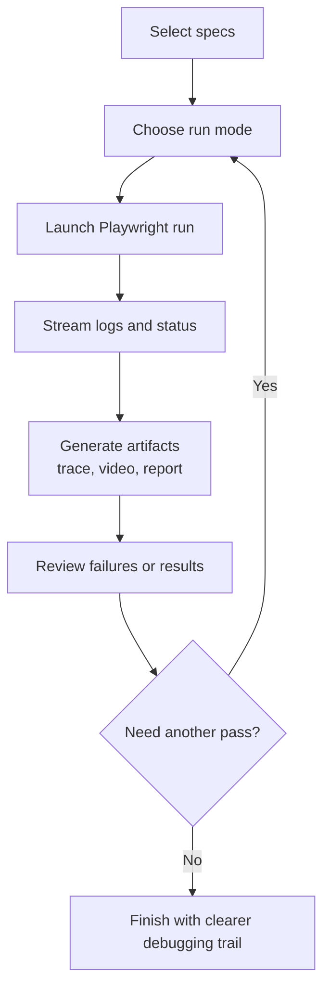

# Playwright Command Center

Playwright Command Center is a QA tooling project built around a Playwright automation framework and a local launcher UI for running, debugging, and reviewing end-to-end tests more efficiently.

The repo uses ParaBank as the example application, but the main point of the project is the workflow: faster spec execution, easier artifact access, clearer debugging loops, and more maintainable automation patterns.

## What This Project Demonstrates

- Playwright-based end-to-end automation using page objects, fixtures, and shared utilities
- A local command center for launching tests, running grouped suites, and reviewing traces, videos, and reports
- API-aware UI testing patterns that reduce flake around backend state changes
- Practical QA tooling and workflow design rather than just a collection of test scripts

## Repo Structure

- `tests/specs/`: end-to-end scenarios
- `tests/pages/`: page objects
- `tests/fixtures/`: test fixtures
- `tests/utils/`: helpers for data generation and network-aware flows
- `config/`: environment defaults
- `docs/`: supporting notes for project pitch, walkthrough, and Cypress parity planning
- `scripts/command-center.mjs`: terminal dashboard for grouped suite execution
- `scripts/test-launcher/`: local browser-based launcher UI for single-spec and suite workflows
- `skill/`: prompt/analysis files for AI-assisted QA planning and codebase review

## Example Flows Covered

1. User registration and login validation
2. Negative login validation
3. Open account flow
4. Transfer funds
5. Bill payment
6. API observability around transfer behavior

## Why The Command Center Exists

This project was built around a practical QA problem: Playwright is powerful, but day-to-day debugging and rerun workflows can still be too command-line heavy when you are iterating quickly, demoing a suite, or investigating flaky behavior.

The command center approach improves that loop by making it easier to:

- run the right spec quickly
- switch between headed, headless, trace, video, and UI modes
- rerun failed tests without rebuilding commands each time
- open the latest artifacts directly
- review run history in one place

## Workflow Overview



## Run Locally

```bash
npm ci
npx playwright install chromium
npm run test:e2e
```

## Useful Commands

```bash
# Standard test run
npm run test:e2e

# Playwright UI mode
npm run test:e2e:ui

# Headed Chromium run
npm run test:e2e:headed

# Mobile Chrome project
npm run test:e2e:mobile

# Open HTML report
npm run test:e2e:report

# Terminal command center
npm run test:e2e:dashboard

# Browser-based launcher UI
npm run test:e2e:launcher
```

## Browser-Based Launcher UI

The launcher in `scripts/test-launcher/` provides a local UI for running specs and reviewing artifacts with less friction than repeated manual CLI commands.

Main features:

- Global Spec Cart for batch selection
- Dynamic spec detection
- One-click command presets such as Debug, Headed, Headless, UI Mode, Trace, Video, and Repeat
- Combined suite execution with HTML report output
- Per-test actions for latest trace and video
- Global actions for rerunning failed tests, opening reports, and stopping active runs
- Run history with timestamps, status, and duration
- Target selection for `chromium` and `mobile-chrome`

Start it with:

```bash
npm run test:e2e:launcher
```

Then open:

```text
http://127.0.0.1:4173
```

## Terminal Dashboard

`scripts/command-center.mjs` provides a lightweight terminal dashboard for grouped suite execution. By default it can run suites in parallel across `chromium` and `mobile-chrome` and write worker logs to `test-results/*.log`.

```bash
CC_PROJECTS=chromium,mobile-chrome CC_RETRIES=1 npm run test:e2e:dashboard
```

## Network-Aware Testing Pattern

Transaction-heavy flows such as registration, account creation, transfers, and bill pay use `page.waitForResponse(...)` at backend state boundaries.

The intent is straightforward:

- use one network checkpoint when server state actually changes
- keep user-facing UI assertions in place
- reduce flaky timing failures without turning tests into intercept-heavy scripts

This logic is centralized in `tests/utils/network.ts` so page objects stay cleaner and the pattern remains consistent.

One concrete bug this helped expose:

- the transfer flow intermittently failed with ParaBank `Error! An internal error has occurred`
- network checkpoints plus page-state review showed the flow was sometimes submitting invalid source/destination combinations
- the fix was to explicitly select distinct accounts before submit and validate the transfer API response

## Environment

Defaults are defined in `config/env.ts`.

Override the base URL when needed:

```bash
BASE_URL="https://parabank.parasoft.com/parabank/index.htm" npm run test:e2e
```

## AI-Assisted QA Files

The `skill/` folder contains structured prompt assets for AI-assisted QA planning and analysis:

- `skill/e2e-migration-coordinator.md`
- `skill/codebase-analyzer.md`
- `skill/user-flow-analyst.md`

These are included to show how AI can support test strategy and codebase analysis without replacing the underlying QA judgment or framework design.

## Supporting Docs

- `docs/project-pitch.md`: short pitch and business-value framing
- `docs/example-walkthrough.md`: example walkthrough and demo notes
- `docs/cypress-command-center-parity.md`: guidance for porting the command-center pattern to Cypress
